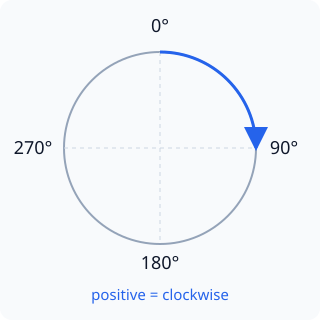

# Arc (`gsp_arc`)

Circular value indicator with an optional draggable range.

## When to use

Use it when a user must inspect or change a bounded numeric value.

## Local interactive preview

First [set up the commands from the compatibility guide](../reference/compatibility.md#tool-commands),
then run from an unpacked component or public repository root:

```sh
mkdir -p gsp-out/widget-preview
gspc pack \
  examples/usage/widgets/arc/arc.json \
  --deployable -o gsp-out/widget-preview/arc.gspb
gsp_sim_host \
  --bundle gsp-out/widget-preview/arc.gspb
```

These commands compile the JSON below and open it in the ESP-GSP simulator's
browser preview.

This preview shows the initial state authored in JSON. To reproduce application-driven motion, update the corresponding properties through the simulator backend/API or device code.

## Runtime behavior

Pointer input updates retained component state through the same runtime property path used on device.

`start_angle` is measured clockwise from the top: right is 90°, bottom 180°, left 270°. `sweep` is a clockwise span of 1–360°; increasing value from min to max fills in that direction.



Give every object that application code must read or update a stable `name`. GSPC generates the typed functions listed below for named objects.

## Complete example JSON

```json
{
  "screen": "widget_arc",
  "w": 480,
  "h": 320,
  "screen_bg": "#101827",
  "objects": [
    {
      "type": "arc",
      "parent": -1,
      "name": "level",
      "x": 150,
      "y": 55,
      "w": 180,
      "h": 180,
      "min": 0,
      "max": 100,
      "value": 72,
      "start_angle": 135,
      "sweep": 270,
      "thickness": 18,
      "bg_color": "#334155",
      "fg_color": "#38BDF8"
    },
    {
      "type": "arc",
      "parent": -1,
      "x": 190,
      "y": 95,
      "w": 100,
      "h": 100,
      "value": 38,
      "start_angle": 180,
      "sweep": 180,
      "thickness": 10,
      "bg_color": "#293548",
      "fg_color": "#A78BFA"
    }
  ]
}
```

This is `examples/usage/widgets/arc/arc.json`. Copy any relative assets referenced by the scene with it.

## Generated C API for this example

```c
const gsp_component_directory_t *const * gsp_arc_docs_component_directories(uint16_t *out_count)
esp_err_t gsp_widget_arc_level_get_effective_visible(esp_gsp_handle_t gsp, bool *out_visible)
esp_err_t gsp_widget_arc_level_get_info(esp_gsp_handle_t gsp, esp_gsp_component_info_t *out_info)
esp_err_t gsp_widget_arc_level_get_value(esp_gsp_handle_t gsp, int32_t *out_value)
esp_err_t gsp_widget_arc_level_set_value(esp_gsp_handle_t gsp, int32_t value)
esp_gsp_config_t gsp_arc_docs_config(void)
size_t gsp_arc_docs_dynamic_image_slots(void)
```

These signatures come from the actual compiler output for this JSON.

## Fields used by this example

| Field | Type | Required | Default / range | Dynamic | Compiler definition |
|---|---|---:|---|---:|---|
| `type` | `string` | yes | — | — | widget type |
| `parent` | `int` | yes | default -1; -1…65534 | — | parent object index (-1 = screen root) |
| `x` | `int` | yes | default 0; -32768…32767 | scene: yes; template: — | x relative to parent |
| `y` | `int` | yes | default 0; -32768…32767 | scene: yes; template: — | y relative to parent |
| `w` | `int` | yes | 0…65535 | scene: —; template: — | width in px |
| `h` | `int` | yes | 0…65535 | scene: —; template: — | height in px |
| `name` | `identifier` | — | — | — | stable component name; generates GSP_OBJ_KEY_&lt;NAME&gt; |
| `fg_color` | `color` | — | — | — | foreground color (text/knob/line/mark per type) |
| `bg_color` | `color` | — | — | yes | background/fill color (#RRGGBB or #RRGGBBAA) |
| `value` | `int` | — | — | yes | initial value (in min..max units) |
| `min` | `int` | — | default 0; -2147483648…2147483647 | — | value range lower bound |
| `max` | `int` | — | default 100; -2147483648…2147483647 | — | value range upper bound |
| `start_angle` | `int` | — | default 135; 0…359 | scene: yes; template: — | arc start angle clockwise from top (0 top, 90 right) |
| `sweep` | `int` | — | default 270; 1…360 | — | clockwise arc span in degrees |
| `thickness` | `int` | — | 0…65535 | — | stroke thickness; omitted = max(min(w,h)/8, 2); 0 clamps to 1 |

<details><summary>Show other fields supported by this Widget</summary>

| Field | Type | Required | Default / range | Dynamic | Compiler definition |
|---|---|---:|---|---:|---|
| `min_width` | `int` | — | 0…65535 | — | compile-time minimum width in px |
| `max_width` | `int` | — | 0…65535 | — | compile-time maximum width in px |
| `min_height` | `int` | — | 0…65535 | — | compile-time minimum height in px |
| `max_height` | `int` | — | 0…65535 | — | compile-time maximum height in px |
| `layout` | `enum` | — | `row`, `column` | — | child auto-layout: row/column |
| `gap` | `int` | — | default 0; 0…4096 | — | auto-layout gap in px |
| `padding` | `int` | — | default 0; 0…4096 | — | auto-layout padding in px |
| `padding_left` | `int` | — | 0…4096 | — | row layout: leading padding override |
| `padding_right` | `int` | — | 0…4096 | — | row layout: trailing padding override |
| `padding_top` | `int` | — | 0…4096 | — | column layout: leading padding override |
| `padding_bottom` | `int` | — | 0…4096 | — | column layout: trailing padding override |
| `grow` | `int` | — | default 0; 0…100 | — | auto-layout grow weight |
| `margin` | `int` | — | default 0; 0…4096 | — | auto-layout space on both child sides |
| `margin_left` | `int` | — | 0…4096 | — | auto-layout leading margin on the x axis |
| `margin_right` | `int` | — | 0…4096 | — | auto-layout trailing margin on the x axis |
| `margin_top` | `int` | — | 0…4096 | — | auto-layout leading margin on the y axis |
| `margin_bottom` | `int` | — | 0…4096 | — | auto-layout trailing margin on the y axis |
| `align_main` | `enum` | — | `start`, `center`, `end`, `space_between` | — | auto-layout main-axis placement |
| `align_cross` | `enum` | — | `start`, `center`, `end`, `stretch` | — | auto-layout cross-axis placement |
| `hidden` | `bool` | — | default `false` | yes | start hidden (show via actions or set_visible) |
| `opacity` | `int` | — | default 255; 0…255 | scene: —; template: — | 0-255 blend opacity |
| `bg_gradient` | `color` | — | — | — | second gradient stop (with bg_color) |
| `gradient_dir` | `enum` | — | default vertical; `vertical`, `horizontal` | — | gradient direction |
| `radius` | `int` | — | default 0; 0…65535 | scene: —; template: — | corner radius in px |
| `shadow_color` | `color` | — | — | — | static hard-shadow color |
| `shadow_opacity` | `int` | — | default 96; 0…255 | — | static hard-shadow opacity |
| `shadow_offset_x` | `int` | — | -32768…32767 | — | static hard-shadow x offset |
| `shadow_offset_y` | `int` | — | -32768…32767 | — | static hard-shadow y offset |
| `shadow_spread` | `int` | — | 0…4096 | — | static hard-shadow spread in px |
| `shadow_radius` | `int` | — | 0…65535 | — | static hard-shadow corner radius |
| `border_color` | `color` | — | — | — | border stroke color |
| `border_width` | `int` | — | 0…65535 | — | border stroke width (needs border_color) |
| `border_opacity` | `int` | — | default 255; 0…255 | — | border stroke opacity |
| `outline_color` | `color` | — | — | — | outside outline color |
| `outline_width` | `int` | — | default 0; 0…65535 | — | outside outline width |
| `outline_opacity` | `int` | — | default 255; 0…255 | — | outside outline opacity |
| `outline_pad` | `int` | — | default 0; 0…4096 | — | gap between the element and its outline |
| `text_line_space` | `int` | — | default 0; 0…4096 | — | extra spacing between static text rows in px |
| `text_vertical_align` | `enum` | — | default auto; `auto`, `top`, `center`, `bottom` | — | static text block placement; auto preserves single-line center and multiline top |
| `text` | `string` | — | — | yes | static text content (UTF-8) |
| `text_align` | `enum` | — | `left`, `center`, `right` | — | text alignment |
| `overflow` | `enum` | — | default clip; `clip`, `ellipsis` | — | single-line overflow |
| `font` | `path` | — | — | — | per-object TTF/OTF override |
| `font_size` | `int` | — | 1…255 | — | per-object font pixel size |
| `font_charset` | `string` | — | — | — | glyphs available to runtime-bound text; static text is added automatically |
| `font_charset_file` | `path` | — | — | — | UTF-8 character corpus relative to the scene; combined with font_charset and static text |
| `font_link` | `enum` | — | `embedded`, `external`, `auto` | — | font storage policy: embedded/external/auto |
| `input` | `bool` | — | default `false` | — | text field: attaches the caret/keyboard flow |
| `animation_codec` | `enum` | — | `lossless`, `jpeg`, `hardware_jpeg` | — | animation frame policy: lossless patches, JPEG full frames, or JPEG when the target has hardware decoding |
| `svg_layout` | `enum` | — | `content`, `canvas` | — | SVG part placement: cropped content or original canvas |
| `morph_to` | `path` | — | — | — | SVG end shape with matching paths and paints |
| `morph` | `int` | — | 0…100 | — | SVG shape interpolation progress (percent); generates a runtime setter |
| `svg_element` | `string` | — | — | — | SVG element id; imports its painted bounds as an independent image |
| `tint` | `color` | — | — | — | SVG silhouette color; generates a runtime color setter |
| `image` | `path` | — | — | yes | image file path (raster or compiled SVG) |
| `codec` | `enum` | — | `raw`, `lossless`, `jpeg`, `auto`, `speed`, `size`, `store`, `qoi`, `rle16`, `rle16_a8`, `rle32`, `default`, `hardware_jpeg` | — | image codec |
| `quality` | `int` | — | 1…100 | — | JPEG quality 1-100 (omitted = profile default) |
| `jpeg_quality` | `int` | — | 1…100 | — | legacy JPEG quality alias |
| `compress` | `bool` | — | — | — | image compression toggle (legacy; prefer codec) |
| `cache_policy` | `enum` | — | `mmap_direct`, `mmap`, `decode_lru`, `lru`, `preload` | — | image cache policy: mmap_direct, decode_lru or preload |
| `store_scale` | `number` | — | 0.05…1.0 | — | pre-scale factor applied when encoding |
| `max_fps` | `int` | — | 0…120 | — | GIF/animation frame-rate cap (0 = uncapped) |
| `fit` | `enum` | — | default stretch; `stretch`, `fill`, `contain`, `cover` | — | image fit mode |
| `position_x` | `number` | — | default 0.5; 0.0…1.0 | — | image fit horizontal alignment |
| `position_y` | `number` | — | default 0.5; 0.0…1.0 | — | image fit vertical alignment |
| `rotation` | `int` | — | default 0; -32768…32767 | scene: image; template: — | clockwise image rotation around the bounding-box center; source alpha is supported; clipped to the box |
| `scalable` | `bool` | — | default `false` | — | enable runtime image scaling |
| `scale` | `number` | — | default 1.0; 0.0625…16.0 | — | initial runtime image scale |
| `min_scale` | `number` | — | default 0.5; 0.0625…16.0 | — | minimum runtime image scale |
| `max_scale` | `number` | — | default 4.0; 0.0625…16.0 | — | maximum runtime image scale |
| `vertical` | `bool` | — | default `false` | — | vertical orientation |
| `enabled` | `bool` | — | — | — | initial interaction state; when present, exposes a runtime enabled property inherited by descendant controls |
| `disabled_color` | `color` | — | default #808080 | — | disabled-state overlay color |
| `disabled_opacity` | `int` | — | default 112; 0…255 | — | disabled-state overlay opacity |
| `bind` | `identifier` | — | — | — | public state name; generates GSP_BIND_&lt;NAME&gt; |
| `bind_target` | `enum` | — | `visible`, `value`, `color`, `text`, `resource`, `data` | — | explicit bind state family |
| `callback` | `identifier` | — | — | — | app callback name; generates scene-qualified event helpers |
| `events` | `action_list` | — | — | — | input bindings: [{event, action, ...}] |
| `template` | `identifier` | — | — | — | declare this subtree as a render template |
| `max_instances` | `int` | — | 1…65535 | — | maximum simultaneously live template instances; included in the automatic pool requirement |
| `dynamic_color` | `bool` | — | — | — | template member exposes a per-instance color slot |
| `dynamic_image` | `bool` | — | — | — | template image exposes a per-instance resource slot |
| `interactive` | `bool` | — | default `true` | — | allow pointer interaction |

</details>

<details><summary>Show fields shared by every Widget</summary>

| Field | Type | Required | Default / range | Dynamic | Compiler definition |
|---|---|---:|---|---:|---|
| `parent_name` | `string` | — | — | — | parent by name instead of index |

</details>
